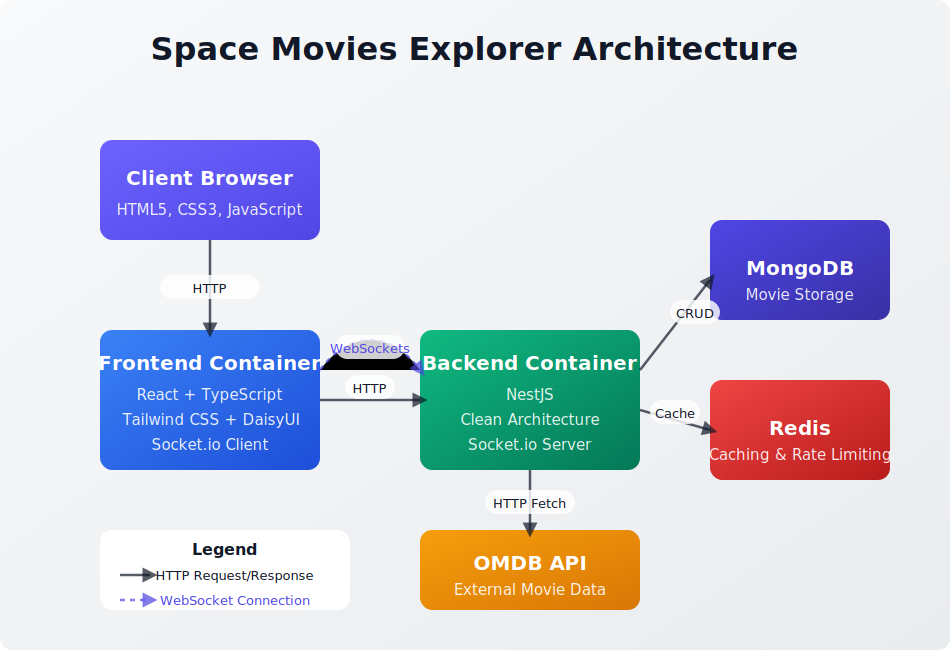

# Space Movies Explorer

A full-stack application that fetches space-themed movies from the OMDB API, stores them in a MongoDB database, and provides a user-friendly interface for searching and browsing these movies.

## Architecture Overview

This project follows a clean architecture approach with a containerized microservices structure:



The system consists of the following components:

- **Frontend**: React application with TypeScript that provides a responsive user interface
- **Backend**: NestJS application that manages data fetching, storage, and retrieval
- **MongoDB**: Primary data store for movie information
- **Redis**: Cache layer for improved performance and throttling
- **WebSockets**: Real-time updates for long-running operations

### Key Features

- Fetch and store space-themed movies from the OMDB API
- Real-time progress tracking for fetch operations
- Search movies by title, director, or plot
- Responsive UI with movie cards showing posters and details
- Comprehensive test coverage
- Optimized performance with caching

## Getting Started

### Prerequisites

- Docker and Docker Compose installed on your system
- An OMDB API key (get one at [omdbapi.com](https://www.omdbapi.com/apikey.aspx))

### Quick Start

1. Clone this repository:

   ```
   git clone <repository-url>
   cd space-movies
   ```

2. Create a `.env` file in the root directory with the following content:

   ```
   # OMDB API
   OMDB_API_KEY=your_api_key_here

   # App settings
   PORT=3000
   NODE_ENV=production
   ```

3. Start the application:

   ```
   docker-compose up
   ```

4. Access the application:
   - Frontend: http://localhost
   - Backend API: http://localhost:3000
   - API Documentation: http://localhost:3000/api

### Environment Variables

| Variable     | Description                  | Default                            |
| ------------ | ---------------------------- | ---------------------------------- |
| OMDB_API_KEY | Your OMDB API key (required) | -                                  |
| PORT         | Backend server port          | 3000                               |
| NODE_ENV     | Environment mode             | production                         |
| MONGODB_URI  | MongoDB connection string    | mongodb://mongo:27017/space-movies |
| REDIS_HOST   | Redis host                   | redis                              |
| REDIS_PORT   | Redis port                   | 6379                               |

## Using the Application

1. **Browsing Movies**:

   - When you first access the application, it displays a list of existing movies
   - Use the pagination controls to navigate through the collection

2. **Searching Movies**:

   - Use the search bar at the top to find specific movies
   - The search queries titles, directors, and plots

3. **Fetching New Movies**:
   - Click the "Fetch New Movies" button to initiate a new data fetch
   - You can specify a search term (defaults to "space") and year (defaults to "2020")
   - A real-time progress indicator will show the fetch status

## Project Structure

```
space-movies/
├── docker-compose.yml     # Docker compose configuration
├── .env                   # Environment variables
├── backend/               # NestJS backend application
└── frontend/              # React frontend application
```

## Development

For development purposes, you can run each service individually. See the respective README files in the backend and frontend directories for detailed instructions.

## Testing

The project includes comprehensive test coverage for both frontend and backend components:

```
# Run backend tests
docker-compose exec backend pnpm test

# Run frontend tests
docker-compose exec frontend pnpm test
```
